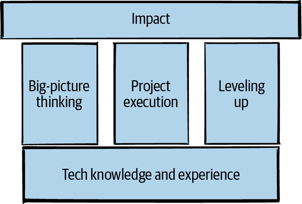

### Big-picture thinking
It means seeing beyond the immediate details and understanding the context that you’re working in. It also means thinking beyond the current time, whether that means initiating yearlong projects, building software that will be easy to decommission, or predicting what your company will need in three years.

### Execution
At the staff level, the projects you take on will become messier and more ambiguous. They’ll involve more people and need more political capital, influence, or culture change to succeed.

### Leveling up
Every increase in seniority comes with more responsibility for raising the standards and skills of the engineers within your orbit. This responsibility will include intentional influence through teaching and mentoring, as well as the accidental influence that comes from being a role model.

> Technical knowledge is not enough. Success and growth at this level means doing more than you can do with technical skills alone.

### Required “Humaning” Skills for Staff+
- Communication and leadership
- Navigating complexity
- Putting your work in perspective
- Mentorship, sponsorship, and delegation
- Framing a problem so that other people care about it
- Acting like a leader whether you feel like one or not

