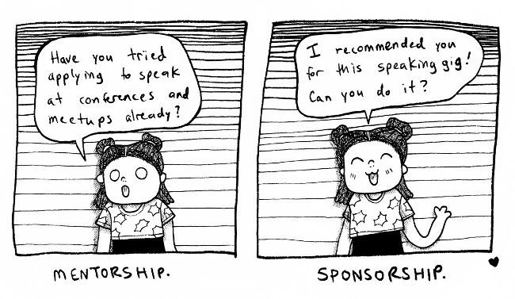

Setting and editing technical direction, providing sponsorship and mentorship, injecting engineering context into organizational decisions, exploration, and what [Tanya Reilly](https://noidea.dog) calls [being glue](https://noidea.dog/glue).
## Setting technical direction
Technology cannot speak for itself and requires effective advocates on its behalf.
Some Staff-plus engineers are explicitly hired to lead a specific area such [as API design](part0034.xhtml),
> One constant across all roles is that the reality of setting technical direction is far more about understanding and solving the real needs of the organization around you and far less about prioritizing technology and approaches that you personally are excited to learn about.
## Mentorship and sponsorship
The best way to grow those around you is by creating an active practice of mentorship and sponsorship.
The most effective Staff engineers pair a moderate amount of mentorship with considerably more sponsorship: putting your thumb directly on the scale to help advance and support those around you.

> In mentorship, the link to getting promoted and receiving developmental assignments has weakened, while sponsoring involves advocating for someone to be promoted and ensuring they receive important assignments.
## Providing engineering perspective
Companies often struggle when an unexpected decision shows up. The sort which is both time-sensitive and important, and it’s challenging to even pull the right folks together before the decision needs to get made. It’s frequent for [an organizational restructure](https://lethain.com/running-an-engineering-reorg/) to occur without valuable input that would have changed the outcome.
Staff-plus engineers are the folks who will often get unexpectedly pulled [into the room](part0025.xhtml) where this sort of decision is happening. This gives them the opportunity to inject the engineering context and perspective into a decision while it’s still possible to change the outcome.